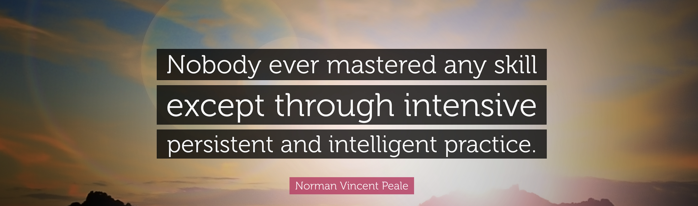

([EN](aboutme.md#en) / [FR](aboutme.md#fr))

### About me
#### Hi there, I am Minh-Hien. 👋 
#### A Junior Data Scientist based in Gent, Belgium.

I have a background in information technology, information systems development (i.e. bachelor and master diplomas), and education. I started my job as an ICT assistant, web developer at the Academic Affairs Dept, then a technical assistant of the university scientific journal (@Scientific Support Unit), and a post-graduate program administrator (@Graduated School) at a multidisciplinary university in Vietnam. I have sustantial experience in managing the data of undergraduate and graduate students and developing the university management systems. I had the chance to complete my dream of studying abroad by obtaining a scholarship for my master's in the Netherlands and the a Ph.D. Belgium.

After finishing my Ph.D. in 2020, I decided to start my journey on AI (Artificial Intelligence) with learning how to program with Python and R. Then, I wanted to undertake more in-depth and serious training. In May 2021, **Becode.org** offered me an opportunity to enter  the fascinating world of data sciences via their excellent full-time professional training. During the course, I worked on several hands-on projects in both #machine learning and #deep learning techniques. I've not only learned from  the technical stuff (e.g. committed errors of colleagues and myself from individual and group projects), but also I learned how to succesfully manage a project (MVP, Agile) and presented our product in a professional manner to the clients.

I am currently about to finish my intensive training. And I'm actively looking for an internship to strengthen my professional skills before getting a full-time job in Data Sciences.
My favourite technologies to work with are: #python, #pandas, #matplotlib, #scikit-learn, #plotly, #tensorflow, #NLP, #computer vision
Learning all about **Data Science, Machine learning**

You can ask me about **Data manipulation**, **Machine learning model creation**,**NLP**, **Model deployment**, **Web development**

Reach me at: minh.hien.vo68@gmail.com, [my Linkedin](https://www.linkedin.com/in/minh-hien-vo/), [my Facebook](https://www.facebook.com/minhhienvo.bxl/), [Twitter](https://twitter.com/vmhienbrus) 

### These are some interesting projects, I conducted during the AI bootcamp with Becode:
**1. Immo_eliza_analysis**: 
The real estate company "ImmoEliza" wants to establish itself as the biggest one in all of Belgium. To pursue this goal, it needs to create a machine learning model to predict prices on Belgium's sales. That way, they can pick out the properties that are the most valuable to them. The AI team will take initiative to create a model that can predict the price based on the influent variables (location, area, property's type, ...).

**2. NYC Motor Vehicle Crashes** 

Bill de Blasio, mayor of New York City, is in a bit of a pickle. Indeed, his police department, the NYPD, collected information about all the traffic accidents that happened in New York City. However, they are too busy eating doughnuts to correctly encode each traffic incident, and so it happens that the dataset that we got here is quite dirty, has a lot of missing values and can't be used by a machine learning model as is. Can you help Mr. de Blasio and shine a new light on his police department ? What he wants exactly is to predict which streets are the most dangerous while visiting the city that never sleeps.

**3. Make an automated bearing testing system**
You're part of a team of sweaty mechanics, working with machines all day. You're not mechanically inclined though, you're hired to make an automated bearing testing system. Your colleagues made the testing machine, you're here to process the data. A client has asked you to make a model to use in an scheduled maintenance system. A sample of the bearings in use of their new-fangled machine would be tested, and your model would predict whether a bearing is **faulty** or not.
Data source: https://www.kaggle.com/general/244271  (Bearing classification dataset)

**4. Wine quality prediction** - [Building Deep Learning Models in Python With Keras](https://github.com/minhhienvo368/wine-quality_prediction_deeplearning)
The aim of the project is to build a neural network model that can predict the quality of wine (i.e. **good or bad**). Then, improving the model performance by tuning hyperparameters.

**5. NLP Sentiment Analysis** - [Email Sentiment Analysis](https://github.com/minhhienvo368/challenge-sentiment-analysis)
You just got an internship at Netflix. As a first task, they ask you to analyze people's reaction to their new show "Squid Game" on Twitter. They are only interested in English speaker's reactions. You must scrape at least 10000 tweets in English containing the hashtag #queengambit or select another series or movie.
Then, you predicted an overall sentiment out of all those tweets.
Must have: 
+ Be able interact with Twitter's API.
+ Be able create a sentiment analysis model.
+ Develop an app to present for the model

**6. Mole detection** - [A computer vision project](https://github.com/minhhienvo368/challenge-mole)
  Mission:
  + Be able to apply a CNN in a real context
  + Be able to preprocess data for computer vision

**7. Using Snorkel to detect CLAs changes** - [a NLP project](https://github.com/minhhienvo368/Laws_changes_notification)

  The client analyzes hundreds of new collective bargaining agreements (CLA) on an annual basis, in order to interpret practical impact and implement them if necessary.  Due to the high volume (>30 / week) of these extensive documents, this is a time consuming process. The task of collecting and processing these new collective agreements needs to be accelerated and automated, in order to enable proactive notification. Using the available meta-data and Artificial Intelligence (NLP) the relevant information will be extracted from the documents. The client needs this information in a structured way, so integrations with existing platforms and/or new reporting is possible.

### Technologies & Tools

### &#x1f4c8; GitHub Stats

<!-- links to social media icons -->
<!-- icons with padding -->

[1.1]: http://i.imgur.com/tXSoThF.png (twitter icon with padding)
[2.1]: http://i.imgur.com/0o48UoR.png (github icon with padding)

<!-- icons without padding -->

[1.2]: http://i.imgur.com/wWzX9uB.png (twitter icon without padding)
[2.2]: http://i.imgur.com/9I6NRUm.png (github icon without padding)

<!-- links to your social media accounts -->

[1]: https://github.com/minhienvo368
[2]: https://www.linkedin.com/in/minh-hien-vo/
[3]: https://www.facebook.com/minhhienvo.bxl/
[4]: https://twitter.com/vmhienbrus

